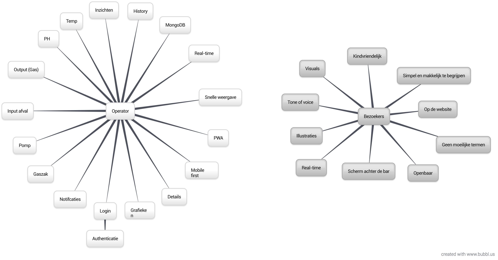
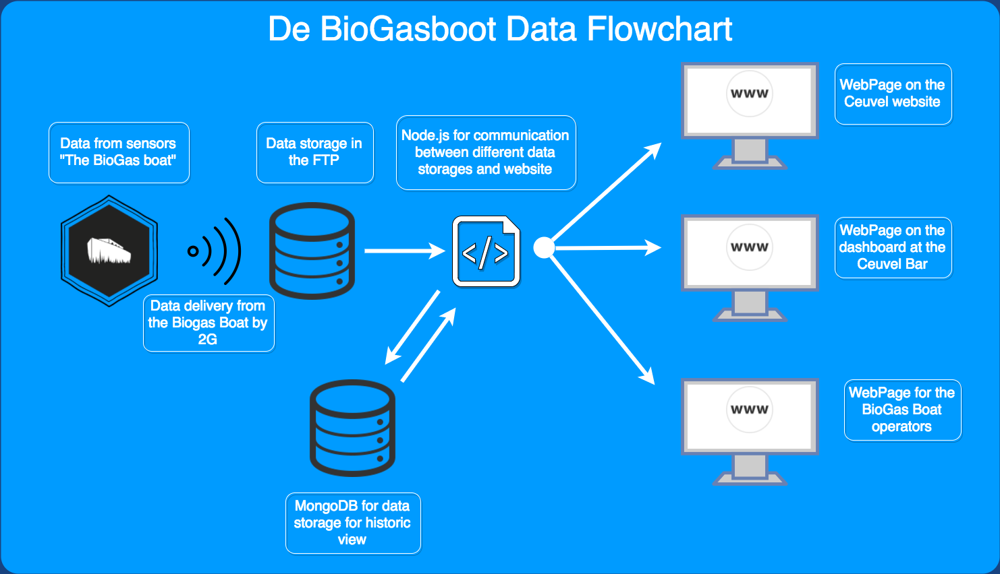
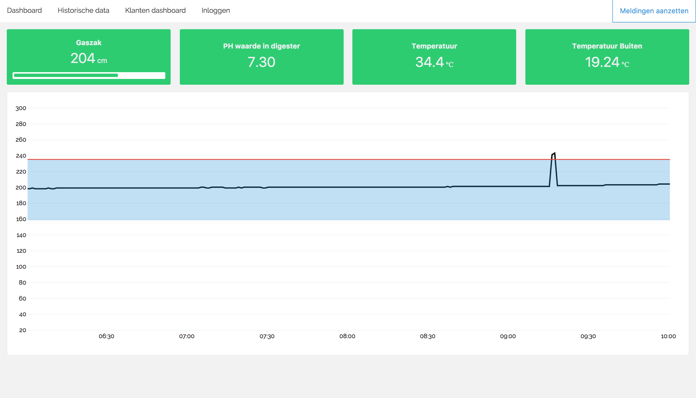
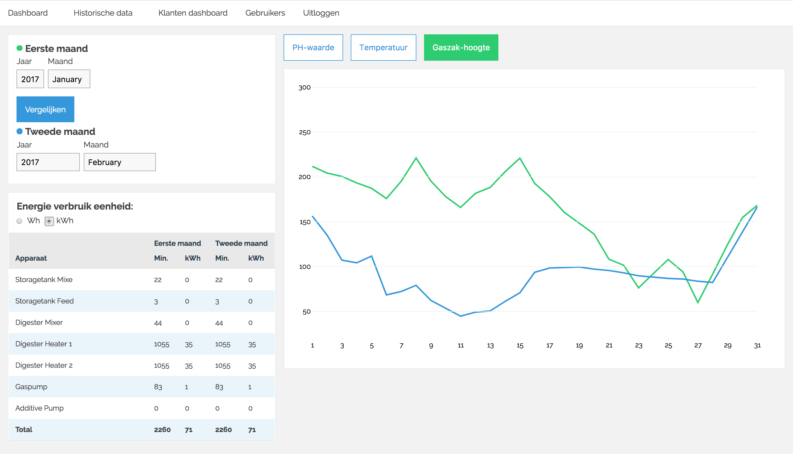
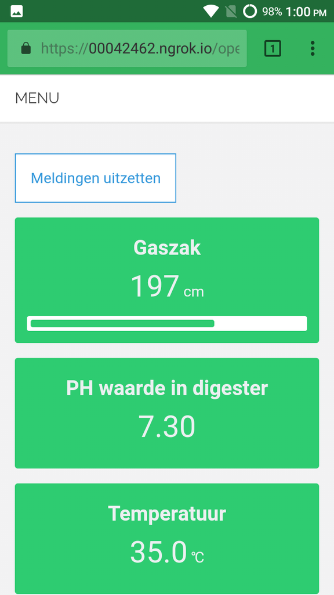

# Biogasboot data visualization
Through sensors that themselves report their data, data is generated about the fermentation process. This data is received by us and translated to a (data) visualisation for both operators and visitors that visit the cafe "De Ceuvel".

Biogasboot data visualization: [Live demo not available yet](#)

## Concept
We have 2 specific target audiences that both needed their own approach.
- **The operators** of the Biogasboot, they have to see all the data that is coming from the sensors of the Biogasboot.
- **The customers** of café De Ceuvel, they don't need all the data but only a fraction of it so realize what the Biogasboot does.



### Operators
The operator is the person who takes control of the food waste digester. He or she wants to know the current state of the digester with the current values of the process parameters. Historical data should be accessible to the operator to determine if a new adjustment had a good effect on the process compared to a previous run. Remarkable trends in the data should also be notified which the operator gets the response of.

### Customers
When a customer is at the bar he or she sees the large TV screen with the Biogasboot it's data. We know that all customers have to order add the bar so they have to see it. It's important that the customer almost instantly knows what the data on the screen means, this can be done for example with illustrations and leading titles. Also the customers have to know from what date the data is measured until the current date. They have to realize how "bio clean" café De Ceuvel's kitchen is.

## Usage
For now operators can see live visualizations of the data generated on the Biogasboot. The visualization shows all the values that are available. It is also possible to look at the historical data. The filter funcionality isn't finished yet though. There are multiple API endpoints that can be used to filter and format the data from the FTP server.

Administrators can register new accounts for other admins and operators. Soon a dashboard for Café de Ceuvel will follow, as well as a interactive website where users can learn more about the Biogasboot. See the ToDo list below for more functions to come!

## Stakeholders
- Operators of the Biogasboot.
- Customers of café "De Ceuvel".
- Employees of café "De Ceuvel".
- The planet :earth_africa:.

## Features
- User system with roles (register and login)
- User management panel for administrators
- Dashboard for the operators with live visualized data from the Biogasboot
- Dashboard for searching and comparing Historical data, visualized in D3
- Dashboard with live visualizations for in Café de Ceuvel


### Single features

***Data Flow: From Boat to Mongo***

The flow has been simulated with test data. The Bio-gas boat is not capable yet to send data in real-time.



***API: Filter data from the API***
This function gets all the data from the API and filters and formats it according to the date and format parameters. For example: Get the average per day in a specific range.
```javascript
function filterData(format, date, data) {
  const returnData = [];
  // Create a new dataObject
  const dataObject = {
    Date: new Date(Number(date) * 1000),
    'Temp_PT100_1': 0,
    'Temp_PT100_2': 0,
    pH_Value: 0,
    Bag_Height: 0,
    count: 0
  };
  const parsedDate = parseDate(new Date(Number(date) * 1000));
  // Fill the dataObject with the data of that day
  data.forEach(function(point) {
    let thisDate = parseDate(point.Date);
    if (thisDate == parsedDate) {
      dataObject['Temp_PT100_1'] = dataObject['Temp_PT100_1'] + Number(point['Temp_PT100_1']);
      dataObject['Temp_PT100_2'] = dataObject['Temp_PT100_2'] + Number(point['Temp_PT100_2']);
      dataObject['pH_Value'] = dataObject['pH_Value'] + Number(point['pH_Value']);
      dataObject['Bag_Height'] = dataObject['Bag_Height'] + Number(point['Bag_Height']);
      dataObject['count'] = dataObject['count'] + 1;
    }
  });
  returnData.push(dataObject);
  return returnData;
}
```

## Screenshots
All views of the dashboard currently in the app





## Dependencies
* [x] [`BCryptjs`](https://www.npmjs.com/package/bcryptjs) Password hashing
* [x] [`Body-parser`](https://www.npmjs.com/package/body-parser) Middleware for body parsing
* [x] [`Connect-flash`](https://www.npmjs.com/package/connect-flash) Store messages in sessions
* [x] [`Cookie-parser`](https://www.npmjs.com/package/cookie-parser) Parse and populate cookies
* [x] [`CSV-parse`](https://www.npmjs.com/package/csv-parse) Convert CSV files into arrays and objects
* [x] [`D3`](https://www.npmjs.com/package/d3) Library for data visualizations
* [x] [`Dotenv`](https://www.npmjs.com/package/dotenv) Load enviroment variables from .env files
* [x] [`EJS`](https://www.npmjs.com/package/ejs) Templating library (Embedded JavaScript templates)
* [x] [`Express`](https://www.npmjs.com/package/express) Web framework for NodeJS (routing)
* [x] [`Express-session`](https://www.npmjs.com/package/express-session) Middleware for creating sessions
* [x] [`Express-validator`](https://www.npmjs.com/package/express-validator) Validator middleware for NodeJS
* [x] [`JSFtp`](https://www.npmjs.com/package/jsftp) Library for FTP access
* [x] [`Line-by-line`](https://www.npmjs.com/package/line-by-line) Reading big text documents without saving to the memory
* [x] [`Moment`](https://www.npmjs.com/package/moment) Parse, validate, manipulate, and display dates
* [x] [`MongoDB`](https://www.npmjs.com/package/mongodb) Official MongoDB library for NodeJS
* [x] [`Mongoose`](https://www.npmjs.com/package/mongoose) MongoDB object modeling
* [x] [`Morgan`](https://www.npmjs.com/package/morgan) HTTP request logger middleware for node.js
* [x] [`Node-Sass-Middleware`](https://www.npmjs.com/package/node-sass-middleware) Compiles .scss and .sass files
* [x] [`Passport`](https://www.npmjs.com/package/passport) Authentication for NodeJS
* [x] [`Passport-http`](https://www.npmjs.com/package/passport-http) HTTP Basic and Digest authentication strategies for Passport.
* [x] [`Passport-local`](https://www.npmjs.com/package/passport-local) Authentication addon for Passport
* [x] [`Request`](https://www.npmjs.com/package/request) Client for HTTP requests
* [x] [`Socket.io`](https://www.npmjs.com/package/socket.io) Enables websockets
* [x] [`Web-push`](https://www.npmjs.com/package/web-push) Library for push notifications

## Dev Dependencies
* [x] [`Debug`](https://www.npmjs.com/package/debug) Debugging utility
* [x] [`XO`](https://www.npmjs.com/package/xo) Configurable ESLinter
* [x] [`Babel-preset-es2015`](https://www.npmjs.com/package/babel-preset-es2015) Babel preset for all es2015 plugins
* [x] [`Babelify`](https://www.npmjs.com/package/babelify) Enables Babel browserify transform
* [x] [`Browserify`](https://www.npmjs.com/package/browserify) Bundle all required JS tags
* [x] [`Imagemin`](https://www.npmjs.com/package/imagemin) Minify images
* [x] [`Imagemin-webp`](https://www.npmjs.com/package/imagemin-webp) Build Web-p images
* [x] [`Ngrok`](https://www.npmjs.com/package/ngrok) Expose localhost to the web
* [x] [`Node-sass`](https://www.npmjs.com/package/node-sass) Compiles .scss to .css
* [x] [`Nodemon`](https://www.npmjs.com/package/nodemon) Watch all files in which Nodemon was started
* [x] [`Watchify`](https://www.npmjs.com/package/watchify) Watch mode for Browserify builds

## ToDo
* [x] Push notification for operators if something goes wrong
* [x] Layout for the history section
* [x] Filters for the history section
* [x] D3 Graphs for comparing time ranges
* [x] Interactive view of the Biogasboot
* [x] Dashboard view for in Café de Ceuvel
* [x] Build a guide for the operator application

## Finished ToDo's
* [x] Range selector to select two dates and pass the range to the front-end
* [x] Data tiles on real-time dashboard have to change color based on status data
* [x] Create functions for showing week, month or year in history view
* [x] API endpoints for data in specific range
* [x] API endpoint for formatting data to get avarage values per day.
* [x] Get files via FTP based on timestamp

## Wishlist
* [ ] Live data from the Biogasboot
* [ ] Plotting of status data
* [ ] Piechart of process devices 
* [ ] Possibility for admins to add event data to the dashboard
* [ ] Smart defaults for selecting range's / views in the backend

## API Endpoints
The application has multiple API endpoints. This is an overview of all the possibilities.

**All data**
`/api/all`
This call returns an object with all the data that is available.

**Date Range data**
`/api/all?dateStart=1489720679&dateEnd=1490268059`
This call returns an object with all the data within the specified date-range The date has to be a UNIX timestamp. You declare the start- and end datel

**Data for a specific day**
`/api/all?format=d&date=1490400000`
This call returns the data of a specific day. All values are added up and the 'count' value can be used to divide the values to get the average of that day. This call needs an UNIX timestamp as date.

**Average per day in a specific range**
`/api/all?dateStart=1489720679&dateEnd=1490268059&format=d`
Get the average per day in a specific range. Use a UNIX timestamp as date, followed by `&format=d`

## Notifications with ServiceWorker
As addition on the websockets we made a ServiceWorker that can send notifications to devices that are subscribed. This is very usefull when a warning state is triggered but the operator isn't watching is phone dashboard. The subscriptions are saved in the MongoDB database so when the server restarts the subscriptions aren't gone To send notifications we needed a GCM_API_KEY (Google Cloud Messaging).

The notifications are used for the real-time dashboard so the operator doesn't have to watch his phone all the time.

## Calculation with the data
The Biogasboot stores the data in a CSV file but this RAW data and we can't do everything with this that. Some stakeholder want a bundle of multiple values but those bundles aren't found in the CSV files.

### Usage calculations
The calculations we did are mostly found in modules/usage-calculation.js here is calculated how long a device is ON in 1 month. When we know how long it's ON we can calculate the energy usage in Wh and kWh. Those calculations are stored in an object and then pushed to the front-end. For every calculation there is a comment how the calculation is working.

## Config variables
The application makes use variables that aren't clear yet so we made a config file where all the different variables are stored.

The config can be founded in the folder "modules/config.js". Here you can define the following things:
 * The min, max, low, high values of a parameter like PH value or gasbag.
 * The above has impact on the tileStatus function that will define the state of a value.
 * Every device has it's own usage per hour this can also changed here.
 * When the control panel of the Biogasboot is connected to a FTP server you can also modify the FTP settings.

```javascript

// It can be included in front-end and backend files you only need to call the right function that you needed

// For backend modules
const config = require('./config');

// For front-end modules
const config = require('../../../modules/config');
```

## Build / Install and start project

### Clone this repo

```console
  git clone https://github.com/sjoerdbeentjes/biogasboot
  cd biogasboot
```

### Install the dependencies
```console
npm install
```

### Setup environment variables (.env)
```console
DB_URL=YOUR_MONGODB_URL
GCM_API_KEY=YOUR_GCM_API_KEY_FROM_GOOGLE
FTP_SERVER=YOUR_FTP_SERVER_IP
FTP_USER=YOUR_FTP_LOGIN_USERNAME
FTP_PASS=YOUR_FTP_LOGIN_PASSWORD
API_KEY=YOUR_API_KEY
```

### Build CSS and JS
This will build the minified and cleaned CSS and JavaScript files.
```console
npm run build
```

### Start server
```console
npm start
```

### Start server with live updates
```console
npm run start-update
```

## Sources
- [De Biogasboot](http://www.biogasboot.nl/)
- [De Ceuvel](http://deceuvel.nl/nl/)

## Collaborators
Diego Staphorst   | Sjoerd Beentjes  | Timo Verkroost  | Camille Sébastien
--- | --- | --- | ---
![Diego Staphorst][diego] | ![Sjoerd Beentjes][sjoerd] | ![Timo Verkroost][timo] | ![Camille Sébastien][camille]
[Contributor link](contributors/diego.md) | [Contributor link](contributors/sjoerd.md) | [Contributor link](contributors/timo.md) | [Contributor link](Contributor/camille.md)

## License
MIT © Diego Staphorst, Sjoerd Beentjes, Timo Verkroost, Camille Sébastien

[diego]: https://avatars0.githubusercontent.com/u/10053770?v=3&s=400 "Diego Staphorst"

[sjoerd]: https://avatars3.githubusercontent.com/u/11621275?v=3&s=400 "Sjoerd Beentjes"

[timo]: https://avatars2.githubusercontent.com/u/17787175?v=3&s=400 "Timo Verkroost"

[Camille]: https://avatars1.githubusercontent.com/u/8942820?v=3&s=400 "Camille Sébastien"
