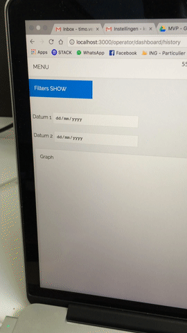

# Contribution of Timo Verkroost
Text

- Download CSV from FTP server
- Usage calculation
- Part of the websockets
- Config file
- Slide-in filter (CSS only), we didn't implement it.
- Compare table in history + switch between Wh and kWh (CSS only)
- User restrictions added
- Structure of dashboard pages (Real-time and History)
- Notifications with ServiceWorker
- Part of the API to calculate usage for each month

## Branches by me
Test

## Process
Explain your process

## Builded parts
Intro

### Config file
To make it easy for everyone who's working with our server I created a config file where all the variables are stored. This file is included in other modules that need the variables. So when the config is changed it will change everywhere where it's included.

This a combine of multiple module settings placed in 1 file.

```javascript

// It can be included in front-end and backend files you only need to call the right function that you needed

// For backend modules
const config = require('./config');

// For front-end modules
const config = require('../../../modules/config');

```

### Download CSV from FTP server
The Biogasboot has a control panel were the data of the process is saved. The data will be pushed to a FTP server so it is accessible via a FTP connection. Note: our server is not the FTP server. The control panel isn't ready yet but we prepared our server to reach the FTP server and save the data in a database. Therefor we needed a FTP connection between the FTP server and our server.

First of all I created a test FTP server on Digital Ocean, because the real one isn't there yet. Then I looked for a module in NPM that can connect to the FTP server and save the files on our server. After that Diego reads the downloaded files and processes them into the MongoDB.

Note: Diego did some refactoring to better processing the data, but the base is from me.

#### NPM modules used
* [`JSFtp`](https://www.npmjs.com/package/jsftp) Library for FTP access

#### Code snippets
* [Config file FTP settings](https://github.com/sjoerdbeentjes/biogasboot/blob/master/modules/config.js#L155-L176)
* [Builded module file](https://github.com/sjoerdbeentjes/biogasboot/blob/master/modules/getFTPFiles.js)

<details>

```javascript

// modules/config.js
const ftpSettings = {
  // Setup the connection to the FTP server
  setup: {
    host: process.env.FTP_SERVER,
    port: 21,
    user: process.env.FTP_USER,
    pass: process.env.FTP_PASS
  },
  // Get VALUE dir, this folder structure is based on the SD-card we received from the control panel
  // The files will be moved to the downloadDir and the values pushed to the mongoDB schema
  value: {
    directory: '/uploads/VALUE/VALUE/',
    downloadDir: '../data/ftp/VALUE/',
    schema: require('../models/dataPoint'),
    fileColumns: ['Date', 'Time', 'Temp_PT100_1', 'Temp_PT100_2', 'pH_Value', 'Bag_Height']
  },
  // Get STATUS dir, this folder structure is based on the SD-card we received from the control panel
  // The files will be moved to the downloadDir and the statuses pushed to the mongoDB schema
  status: {
    directory: '/uploads/STATUS/STATUS/',
    downloadDir: '../data/ftp/STATUS/',
    schema: require('../models/statusPoint'),
    fileColumns: ['Date', 'Time', 'Storagetank_Mixe', 'Storagetank_Feed', 'Digester_Mixer', 'Digester_Heater_1', 'Digester_Heater_2', 'Gaspump', 'Mode_Stop', 'Mode_Manual', 'Mode_Auto', 'System_Started', 'Additive_Pump']
  }
};

```

```javascript

// modules/getFTPFiles.js
// NOTE: this is the first version of the FTP files download module, Diego later refactored the code to better data transfer to mongoDB

// Gets latest file from FTP server and place it on this server (every 30 min, 1800 seconds)
setInterval(() => {
 // Update VALUE dir
 ftpValue.ls("/uploads/VALUE/VALUE/", function(err, res) {
   // Get latest file name
   const totalFilesVALUE = res.length - 1;
   const latestFileVALUE = res[totalFilesVALUE].name;
   // Copy latest from FTP to this server
   ftpValue.get('/uploads/VALUE/VALUE/'+ latestFileVALUE, path.join(__dirname, `../data/ftp/VALUE/${latestFileVALUE}`), function(hadErr) {
     if (hadErr)
       console.error(hadErr);
     else
       console.log('VALUE file copied successfully!');
   });
 });

// Update STATUS dir
ftpStatus.ls("/uploads/STATUS/STATUS/", function(err, res) {
 // Get latest file name
 const totalFilesSTATUS = res.length - 1;
 const latestFileSTATUS = res[totalFilesSTATUS].name;
 // Copy latest from FTP to this server
 ftpStatus.get('/uploads/STATUS/STATUS/'+ latestFileSTATUS, path.join(__dirname, `../data/ftp/STATUS/${latestFileSTATUS}`), function(hadErr) {
   if (hadErr)
     console.error(hadErr);
   else
     console.log('STATUS file copied successfully!');
 });
});
```

</details>

### Usage calculation
The control panel of the Biosgasboot saves when one of the devices (inside the Biogasboot) is going ON or OFF. From this data we had to calculate how long each device was running so we can essentially can measure the efficiention of the Biogasboot. But the base will show how many energy each device uses (Wh and kWh) also it's possible to see how many minutes each device was ON.

This module is integrated into our API so when a request is made to the URL with the range the server calculates that the usage for each device is and then returns it so it can be processed into the front-end.

#### NPM modules used
* [`Moment`](https://www.npmjs.com/package/moment) Parse, validate, manipulate, and display dates

#### Code snippets
* [Feature branche link for Usage calculation](https://github.com/sjoerdbeentjes/biogasboot/tree/feature/usageCalculation)
* [Builded module file](https://github.com/sjoerdbeentjes/biogasboot/blob/master/modules/usage-calculation.js)

<details>

```javascript

// modules/config.js
// Each device has his own watt usage per hour so this is defined in the config to make it easily editable
const deviceWatts = {
    // Watts per device, those are used in the calculations
    Storagetank_Mixe: {
      watts: 180,
    },
    Storagetank_Feed: {
      watts: 210,
    },
    Digester_Mixer: {
      watts: 0,
    },
    Digester_Heater_1: {
      watts: 2000,
    },
    Digester_Heater_2: {
      watts: 2000,
    },
    Gaspump: {
      watts: 550,
    },
    Mode_Stop: {
      watts: 0,
    },
    Mode_Manual: {
      watts: 0,
    },
    Mode_Auto: {
      watts: 0,
    },
    System_Started: {
      watts: 0,
    },
    Additive_Pump: {
      watts: 0,
    }
};

```

```javascript
// modules/usage-calculation.js
// Counting object so we can measure for each update tick and return the total add the end
getByrange(output, range, req, res) {
  // Clean object for calculation
  let deviceCollection = {
    Storagetank_Mixe: {
      timeON: 0,
      watts: config.deviceWatts['Storagetank_Mixe'].watts,
      kWh: 0,
      Wh: 0
    },
    Storagetank_Feed: {
      timeON: 0,
      watts: config.deviceWatts['Storagetank_Feed'].watts,
      kWh: 0,
      Wh: 0
    },
    Digester_Mixer: {
      timeON: 0,
      watts: config.deviceWatts['Digester_Mixer'].watts,
      kWh: 0,
      Wh: 0
    },
    Digester_Heater_1: {
      timeON: 0,
      watts: config.deviceWatts['Digester_Heater_1'].watts,
      kWh: 0,
      Wh: 0
    },
    Digester_Heater_2: {
      timeON: 0,
      watts: config.deviceWatts['Digester_Heater_2'].watts,
      kWh: 0,
      Wh: 0
    },
    Gaspump: {
      timeON: 0,
      watts: config.deviceWatts['Gaspump'].watts,
      kWh: 0,
      Wh: 0
    },
    Mode_Stop: {
      timeON: 0,
      watts: config.deviceWatts['Mode_Stop'].watts,
      kWh: 0,
      Wh: 0
    },
    Mode_Manual: {
      timeON: 0,
      watts: config.deviceWatts['Mode_Manual'].watts,
      kWh: 0,
      Wh: 0
    },
    Mode_Auto: {
      timeON: 0,
      watts: config.deviceWatts['Mode_Auto'].watts,
      kWh: 0,
      Wh: 0
    },
    System_Started: {
      timeON: 0,
      watts: config.deviceWatts['System_Started'].watts,
      kWh: 0,
      Wh: 0
    },
    Additive_Pump: {
      timeON: 0,
      watts: config.deviceWatts['Additive_Pump'].watts,
      kWh: 0,
      Wh: 0
    },
    All_total: {
      timeON: 0,
      watts: 0,
      kWh: 0,
      Wh: 0
    }
  };
  let i;
  for (i = 1; i < output.length; i++) {
    // Unix time in seconds
    let currentTime = moment(output[i].Date).valueOf() / 1000;
    let beforeTime = moment(output[i - 1].Date).valueOf() / 1000;
    // Adds seconds to
    Object.keys(output[i].toObject()).forEach(function (key) {
      let valNumberBefore = Number(output[i - 1][key]);
      if (valNumberBefore === 1) {
        // Added new seconds to object
        deviceCollection[key].timeON += Number((currentTime - beforeTime));
        // kWh = time in seconds / 3600 (is hours) * watts / 1000
        deviceCollection[key].kWh = ((deviceCollection[key].timeON / 3600) * deviceCollection[key].watts / 1000).toFixed(2);
        // Wh = time in seconds / 3600 (is hours) * watts
        deviceCollection[key].Wh = ((deviceCollection[key].timeON / 3600) * deviceCollection[key].watts).toFixed(2);
      }
  
    });
  }
  // Returns when data is calculated
  if (i === output.length) {
    // Counting totals
    for(let key in deviceCollection) {
      // Skip all total to prevent duplicate counting
      if (deviceCollection[key] !== deviceCollection['All_total']) {
        // Delete unused datapoints
        delete deviceCollection['Mode_Auto'];
        delete deviceCollection['Mode_Manual'];
        delete deviceCollection['Mode_Stop'];
        delete deviceCollection['System_Started'];
        // Calculate totals
        deviceCollection['All_total'].timeON += Number(deviceCollection[key].timeON);
        deviceCollection['All_total'].kWh += Number(deviceCollection[key].kWh);
        deviceCollection['All_total'].Wh += Number(deviceCollection[key].Wh);
      } else {
        // When done send to endpoint
        res.send(deviceCollection)
      }
    }
  }
}
```

```javascript
// routes/api.js
// This is the API request that triggers the usage calculation module
router.get('/status/range/:range', (req, res, next) => {
  if (req.param('api_key') && req.param('api_key') == process.env.API_KEY) {
    const range = req.params.range;
    usageCalculation.init(req, res, range);
  } else {
    res.send('No valid API key');
  }
});
```

</details>

### Part of the websockets
To see the data that the control panel is pushing to de FTP "real-time" we created a real-time dashboard, we asked what the interval of the control panel update is that should be around 30 minutes. My part in the real-time visualisation is to create a indicator when a value is at a warning state. I did this with the tiles that change color. First I created 3 states (error, warning and good) but later changed to 2 status (warning and good) this was more realistic because when a warning is pushed the operator already has to take action and when an error it's already to late. Also the control panel will mostly prevent errors.

#### NPM modules used
* [`Socket.io`](https://www.npmjs.com/package/socket.io) Enables websockets

#### Code snippets
I created a seperate module for the states but later merged it in the config because then we can better use it everywhere.
* [Builded module in config file](https://github.com/sjoerdbeentjes/biogasboot/blob/master/modules/config.js#L2-L118)
* [Builded SCSS file](https://github.com/sjoerdbeentjes/biogasboot/blob/master/src/scss/03-proteins/currentData.scss)

<details>

```javascript

// modules/config.js
// values when attention is required or not.
const statusData = {
  // Set default status indicators
  phStatus: 0,
  tempStatus: 0,
  gasbagStatus: 0
};
// Explain number meanings
// Send status code
// 0 = Good
// 1 = Error
// Gasbag indicator
switch (true) {
  case data.Bag_Height >= this.defineValues['gasbag'].low && data.Bag_Height <= this.defineValues['gasbag'].high:
    // Good
    statusData.gasbagStatus = 0;
    break;
  case data.Bag_Height > this.defineValues['gasbag'].high:
    // Error + bag is almost full
    statusData.gasbagStatus = 1;
    break;
  case data.Bag_Height < this.defineValues['gasbag'].low:
    // Error + bag is almost empty
    statusData.gasbagStatus = 2;
    break;
  default:
    statusData.gasbagStatus = 0;
    break;
}

```

```javascript
// modules/websockets.js
// Send the status indicators with the socket emit
io.sockets.emit('dataPoint', dataCollection, config.tileStatus(dataPoints[i]));
```

```javascript
// src/js/modules/real-time-tiles
// This will push the new status to the HTML so it will change
if (document.getElementById('currentData')) {
  const io = require('socket.io-client');
  const socket = io.connect();

  socket.on('dataPoint', (points, tileStatus) => {
    // Get current number of bag height
    const currentBag = Number(points[points.length - 1].Bag_Height);
    const currentTemp = (Number(points[points.length - 1].Temp_PT100_1) + Number(points[points.length - 1].Temp_PT100_2)) / 2;
    const currentPh = Number(points[points.length - 1].pH_Value);

    setValue('#bagCurrent', Math.round(currentBag), tileStatus.gasbagStatus);
    setValue('#tempCurrent', parseFloat(Math.round(currentTemp * 10) / 10).toFixed(1), tileStatus.tempStatus);
    setValue('#phCurrent', parseFloat(Math.round(currentPh * 100) / 100).toFixed(2), tileStatus.phStatus);

    setMeterBar(tileStatus.gasbagStatus, currentBag);
  });
}

function setValue(selector, value, status) {
  const valueEl = document.querySelector(`${selector} .value`);
  const indicatorEl = document.querySelector(selector);

  if (Number(valueEl.innerHTML) !== value) {
    // Update value
    valueEl.innerHTML = value;
    // Indicator
    // Explain number meanings
    // 0 = Good
    // 1 = Error
    indicatorEl.setAttribute('data-status', status);
  }
}
```

```html
<!-- The data-status will indicate the change when the status changed that comes with the websocket -->
<button id="bagCurrent" class="errorValue" data-type="hoogte" data-status="0">
  <div class="inner">
    <h3>Gaszak</h3>
    <span class="value">DB</span> <span class="unit">cm</span>
  </div>

  <div class="meter" data-value="30">
    <div class="meter-inner"></div>
  </div>
</button>
<button id="phCurrent" class="goodValue" data-type="ph" data-status="0">
  <div class="inner">
    <h3>PH waarde in digester</h3>
    <span class="value">DB</span>
  </div>
</button>
<button id="tempCurrent" class="warningValue" data-type="temp" data-status="0">
  <div class="inner">
    <h3>Temperatuur</h3>
    <span class="value">DB</span> <span class="unit">℃</span>
  </div>
</button>
<button id="tempCurrentOutside" class="warningValue" data-type="tempAPI" data-status="0">
  <div class="inner">
    <h3>Temperatuur Buiten</h3>
    <span class="value">DB</span> <span class="unit">℃</span> 
  </div>
</button>

```

```css

/*
src/scss/03-proteins/currentData.scss
The indicator alone will not be visible but I had to style it also this is done with SASS but here is the plain CSS code 
*/

#currentData > button[data-status="0"] {
    background-color: #2ecc71;
    border: 0.3em solid #2ecc71;
    color: #ecf0f1;
}
#currentData > button[data-status="0"].active {
    border: 0.3em solid #25a25a;
}
#currentData > button[data-status="1"],
#currentData > button[data-status="2"] {
    background-color: #e74c3c;
    border: 0.3em solid #e74c3c;
    color: #ecf0f1;
}
#currentData > button[data-status="1"].active,
#currentData > button[data-status="2"].active {
    border: 0.3em solid #d62c1a;
}

```

</details>

### Slide-in filter CSS only (we didn't implement it)
First we thought we needed some filters for mobile on the history dashboard but later we didn't need them. But it was a good experiment to try CSS animations and hide/show technics. Normaly I did this with JS and CSS but for now the challenge was to do it with only CSS and it is possible. But I think this isn't the best way to do it but I learned something of doing it.



#### Code snippets
* [Builded SCSS file](https://github.com/sjoerdbeentjes/biogasboot/blob/master/src/scss/03-proteins/historyData.scss)

<details>

```html

<input name="showFilters" id="showFilters" type="checkbox">
<aside id="filters">
 <div id="filterInput">
   <label>
     Gaszak <input type="checkbox" name="bag" value="Gaszak">
   </label>
   <label>
     PH waarde <input type="checkbox" name="ph" value="PH waarde">
   </label>
   <label>
     Temperatuur <input type="checkbox" name="temp" value="Temperatuur">
   </label>
 </div>
 <label for="showFilters">
   Filters
 </label>
</aside>

```css

/*
src/scss/03-proteins/historyData.scss
The filter is CSS only but we made it with SASS here is the CSS output
*/

label[for="showFilters"] {
    cursor: pointer;
    align-self: flex-start;
    box-sizing: border-box;
    width: 35%;
    padding: 1em;
    background-color: #3498db;
    color: #ffffff;
}
label[for="showFilters"]::after {
    content: 'SHOW';
}
#showFilters:checked + #filters {
    height: 100%;
}
#showFilters:checked + #filters > label[for="showFilters"]::after {
    content: 'HIDE';
}
@media screen and (min-width: 768px) {
    #historyData {
        padding-top: 0;
    }
    #historyData > .inner {
        flex-basis: 70%;
        max-width: 70%;
    }
    label[for="showFilters"] {
        display: none;
    }
    #historyData #filters {
        position: static;
        flex-basis: 30%;
        max-width: 30%;
        height: 100%;
    }
    #historyData #filterInput {
        width: 100%;
    }
}
#showFilters {
    display: none;
}
#showFilters:checked + #filters {
    right: 0;
}
  
```

</details>

### Notifications with ServiceWorker
As addition on the websockets I made a ServiceWorker that can send notifications to devices that are subscribed. This is very usefull when a warning state is triggered but the operator isn't watching is phone dashboard. The subscriptions are saved in the MongoDB database so when the server restarts the subscriptions aren't gone. For the ServiceWorker I used the source [ServiceWorkers Cookbook](https://serviceworke.rs/). Also I used the Web-push module to send the notifcations. To send notifcations I needed a GCM_API_KEY (Google Cloud Messaging).

For me it was a challange to let this work because working with ServiceWorkers can be hard. I tried many things and I'm proud of the result.

#### NPM modules used
* [`Web-push`](https://www.npmjs.com/package/web-push) Library for push notifications
* [`Mongoose`](https://www.npmjs.com/package/mongoose) MongoDB object modeling

#### Code snippets
* [Feature branche link for Notifications](https://github.com/sjoerdbeentjes/biogasboot/tree/feature/serviceworker)
* [Builded module client side](https://github.com/sjoerdbeentjes/biogasboot/blob/feature/serviceworker/src/js/serviceworker-index.js)
* [Builded module server side](https://github.com/sjoerdbeentjes/biogasboot/blob/feature/serviceworker/modules/server-service-worker.js)
* [Builded (part of) module send notifications](https://github.com/sjoerdbeentjes/biogasboot/blob/feature/serviceworker/modules/websockets.js)

<details>

```javascript

// src/js/serviceworker-index.js
// This is the client side script for the ServiceWorker
// Post to /register-serviceworker to add to subscription list and change button state
function subscribe() {
  navigator.serviceWorker.ready.then(registration => {
    return registration.pushManager.subscribe({
      userVisibleOnly: true
    });
  }).then(subscription => {
    console.log('Subscribed', subscription.endpoint);
    // Generate keys
    // Source: https://serviceworke.rs/push-payload_index_doc.html
    let rawKey = subscription.getKey ? subscription.getKey('p256dh') : '';
    key = rawKey ?
      btoa(String.fromCharCode.apply(null, new Uint8Array(rawKey))) :
      '';
    let rawAuthSecret = subscription.getKey ? subscription.getKey('auth') : '';
    authSecret = rawAuthSecret ?
      btoa(String.fromCharCode.apply(null, new Uint8Array(rawAuthSecret))) :
      '';
    return fetch('/operator/register-serviceworker', {
      method: 'post',
      headers: {
        'Content-type': 'application/json'
      },
      body: JSON.stringify({
        endpoint: subscription.endpoint,
        key: key,
        authSecret: authSecret,
      })
    });
  }).then(setUnsubscribeButton);
}

// Post to /unregister-serviceworker to remove from subscription list and change button state
function unsubscribe() {
  getSubscription().then(subscription => {
    return subscription.unsubscribe()
      .then(() => {
        // Post to /unregister-serviceworker to remove from subscription list
        console.log('Unsubscribed', subscription.endpoint);
        return fetch('/operator/unregister-serviceworker', {
          method: 'post',
          headers: {
            'Content-type': 'application/json'
          },
          body: JSON.stringify({
            endpoint: subscription.endpoint
          })
        });
      });
  }).then(setSubscribeButton);
}

```

```javascript

// modules/server-service-worker.js
// This is the server side script for the ServiceWorker
// Register a subscription by adding it to the DB Scheme
app.post('/operator/register-serviceworker', (req, res) => {
  // Get parameters to save device
  const endpoint = req.body.endpoint;
  const p256dh = req.body.key;
  const auth = req.body.authSecret;
  if (checkSubscription(endpoint)) {
    console.log('Subscription added');
    // Add subscription to DB
    const newSubscription = new Subscription({endpoint: endpoint, p256dh: p256dh, auth: auth});
    newSubscription.save(function (err) {
      if (err) return console.error(err);
    });
  }
  res.type('js').send('{"success":true}');
});

// Unregister a subscription by removing it from the DB Scheme
app.post('/operator/unregister-serviceworker', (req, res) => {
  const endpoint = req.body.endpoint;
  if (checkSubscription(endpoint)) {
    console.log('Subscription removed');
    // Remove device from DB based in endpoint when find it will removed
    Subscription.findOneAndRemove({endpoint: endpoint}, function (err, docs) {});
  }
  res.type('js').send('{"success":true}');
});
```

```javascript
// modules/websockets.js
// This will send the notification to the subscribed users, the notification that is send is based on the status value

let payload;

// Send notification
function sendNotification(subscription, payload) {
  // Set notification settings in promise
  webPush.sendNotification({
    endpoint: subscription.endpoint,
    keys: {
      p256dh: subscription.p256dh,
      auth: subscription.auth
    }
  }, payload).then(() => {
    console.log('Push Application Server - Notification sent to ' + subscription.endpoint);
  }).catch((err) => {
    // Remove from subscription list in DB when there is a error
    Subscription.findOneAndRemove({endpoint: subscription.endpoint}, function (err, docs) {});
    console.log('ERROR in sending Notification, endpoint removed ' + subscription.endpoint);
    console.log(err);
  });
}

function sendGasBagHigh() {
  // Get all subscriptions and push message
  Subscription.find((err, subscriptions) => {
    // Message payload (now static but needs to be dynamic)
    payload = 'De gaszak word te hoog!';
    // Loop trough all the subscriptions
    for (let i = 0; i < subscriptions.length; i++) {
      sendNotification(subscriptions[i], payload);
    }
  });
}

function sendGasBagLow() {
  // Get all subscriptions and push message
  Subscription.find((err, subscriptions) => {
    // Message payload (now static but needs to be dynamic)
    payload = 'De gaszak word te laag!';
    // Loop trough all the subscriptions
    for (let i = 0; i < subscriptions.length; i++) {
      sendNotification(subscriptions[i], payload);
    }
  });
}

```

```html
<!-- Disabled will be removed when the ServiceWorker is available in the DOM -->
<div id="subButton">
  <button id="subscriptionButton" disabled>Meldingen aanzetten</button>
</div>

```

</details>

### Compare table in history + switch between Wh and kWh (CSS only)
Previously I made the usage calculation module now I'm gonna use it to render the history page compare months. First I made it possible to loop through the database to find all the year and months available to fill in the compare months.

On the history dashboard it is possible to compare 2 months also to compare the usages of those months. But sometimes you want to see the energy usage in Wh (watt hour) and sometimes in kWh (kilo watt hour). The values ar already saved in the usageCalculation module but it's overkill to show them both at the same time.

So I decided to make a switch possible with only CSS, later JS was added but it works without JS.

#### Code snippets
* [Hitory route](https://github.com/sjoerdbeentjes/biogasboot/blob/master/routes/operator/dashboard-history.js)
* [Builded SCSS file](https://github.com/sjoerdbeentjes/biogasboot/blob/master/src/scss/03-proteins/aside.scss)

```html

<!-- HTML Code -->

```

```css

/* CSS/SASS code */
  
```

### User restrictions added
Explain what you did.

[Feature branche link](#branche)

```javascript

// JavaScript code
  
```

```html

<!-- HTML Code -->

```

```css

/* CSS/SASS code */
  
```

### Structure of dashboard pages (Real-time and History)
Explain what you did.

[Feature branche link](#branche)

```javascript

// JavaScript code
  
```

```html

<!-- HTML Code -->

```

```css

/* CSS/SASS code */
  
```

## Subjects
Explain which subjects you've used.

### Web App from Scratch
Explain

### CSS to the Rescue
Explain 

### Performance Matters
Explain

### Browser Technologies
Explain

### Real-Time Web
Explain 

### Web of Things
Explain